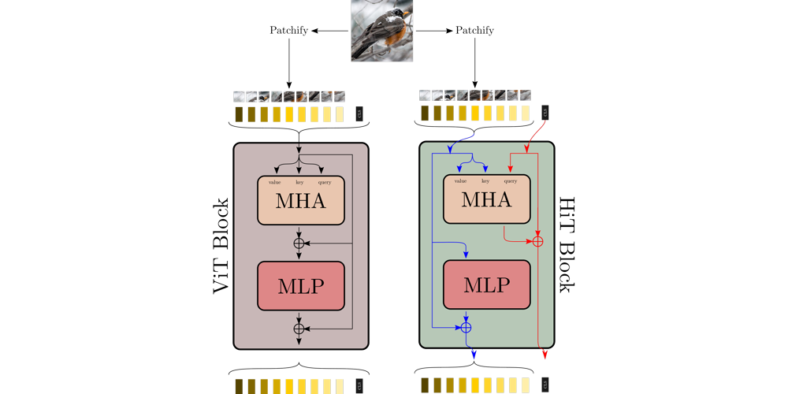

# Hindered Transformer — CVPR 2025 Workshop
**Disentangling Visual Transformers: Patch-level Interpretability for Image Classification**  
**Official Code Repository**

[Webpage](https://guillaumejs2403.github.io/HiT/)

[Paper](https://arxiv.org/abs/2502.17196)



---

## 📦 Model Download

Download ImageNet pretrained weights and config files from HuggingFace [here](https://huggingface.co/guillaumejs2403/HiT/tree/main).  
Note: We do not provide pretrained weights for other datasets, but you can retrain them yourself.

---

## 📁 Dataset Preparation

Preparing datasets is straightforward — just download them, no postprocessing required.

**For ImageNet**, organize the folder as follows:
```
path/to/imagenet/
    ├── train/
    │   ├── class1/
    │   ├── class2/
    │   └── ...
    └── val/
        ├── class1/
        ├── class2/
        └── ...
```

**Other datasets:**
- Stanford Dogs: [Download](http://vision.stanford.edu/aditya86/ImageNetDogs/)  
- Stanford Cars: *(Download link not found — feel free to help!)*  
- CUB-200-2011: [Download](https://www.vision.caltech.edu/datasets/cub_200_2011/)  
- Aircrafts & Oxford Pets: Will be downloaded automatically.

### ➕ Adding a Custom Dataset

Adding a custom dataset is simple! Modify the `build_dataset` function inside `core.datasets.py` to integrate your dataset.

---

## 📊 Evaluating HiT

We provide multiple evaluation scripts for both quantitative and qualitative assessment of HiT.

### 🔍 Classification Accuracy

Run the following to compute accuracy:

```bash
python main.py --eval \
               --data-path $IMNETPATH --batch 512 --input-size 224 \
               --eval-crop-ratio 0.875 \
               --config-file $CONFIGFILE \
               --mini-batches 1 --output_dir $OUTPUTPATH \
               --num_workers 8 \
               --resume path/to/checkpoint
```

### 📈 Insertion/Deletion Metrics

Run this to compute insertion/deletion scores:

```bash
python CausalMetrics.py --gpu-id $GPU \
                        --config-file $CONFIGFILE \
                        --weights $WEIGHTS \
                        --data-path $DATAPATH \
                        --data-set $DATASET \
                        --cam-type base \
                        --model.params.num_classes $NUMCLASSES int
```

> ⚠️ Note: The metric is *unnormalized*. You'll need to normalize it manually.

---

## 🧠 Visualizing HiT Decisions

### Saliency Maps

Similar to the insertion metric — just add an output path:

```bash
python visualization.py --gpu-id $GPU \
                        --config-file $CONFIGFILE \
                        --weights $WEIGHTS \
                        --data-path $DATAPATH \
                        --data-set $DATASET \
                        --cam-type base \
                        --output-path $OUTPUTPATH \
                        --model.params.num_classes $NUMCLASSES int
```

### Layer-wise Saliency Maps

Use `layer-saliency.py`, which uses the same arguments:

```bash
python layer-saliency.py --gpu-id $GPU \
                         --config-file $CONFIGFILE \
                         --weights $WEIGHTS \
                         --data-path $DATAPATH \
                         --data-set $DATASET \
                         --cam-type base \
                         --model.params.num_classes $NUMCLASSES int
```

---

## 🏋️ Training HiT

We trained our models using 8 A100 GPUs with the following:

```bash
IMNETPATH=path/to/imagenet
OUTPUTPATH=path/to/output
CONFIGFILE=configs/hit-b.yaml

torchrun --standalone --nnodes=1 --nproc_per_node=8 main.py \
         --data-path $IMNETPATH --batch 512 --lr 8e-4 \
         --epochs 600 --weight-decay 0.05 --sched cosine --input-size 224 \
         --eval-crop-ratio 0.875 --reprob 0.0 --warmup-epochs 20 \
         --drop 0.0 --seed 0 --opt adamw --warmup-lr 1e-6 \
         --mixup 0.8 --drop-path 0.05 --cutmix 1.0 --unscale-lr --repeated-aug \
         --smoothing 0.1 --color-jitter 0.3 --ThreeAugment \
         --config-file $CONFIGFILE \
         --mini-batches 1 --output_dir $OUTPUTPATH \
         --num_workers 8 --distributed --world_size 8 \
         --model.params.drop_path 0.0 float --model.params.attention_dropout 0.2 float
```

To override config values on-the-fly, use:
```bash
--model.params.param_to_change VALUE TYPE
```
Example: `--model.name hit-no-pool str` disables pooling.

To resume training:
```bash
--resume $OUTPUTPATH/checkpoint.pth
```

To finetune on a new dataset:
```bash
python main.py \
       --data-path $DATAPATH \
       --finetune $PATHWEIGHTS \
       --data-set $DATASET \
       [...] \
       --model.params.num_classes $NUMCLASSES int
```

> Note: Multi-node + multi-GPU setups were not tested.

---

## 📚 Citation

If you use this work, please cite us:

```bibtex
@InProceedings{jeanneret2025disentangling,
    author = {Jeanneret, Guillaume and Simon, Lo{\"\i}c and Jurie, Fr{\'e}d{\'e}ric},
    title = {Disentangling Visual Transformers: Patch-level Interpretability for Image Classification},
    booktitle = {Proceedings of the IEEE/CVF Conference on Computer Vision and Pattern Recognition (CVPR) Workshops},
    month = {June},
    year = {2025}
}
```

---

## 🙏 Acknowledgements

We thank the [DeiT](https://github.com/facebookresearch/deit) repository for their amazing work!

---

## 🐞 Found a bug?

If you find a bug or something doesn't work, feel free to reach out or open an issue!
